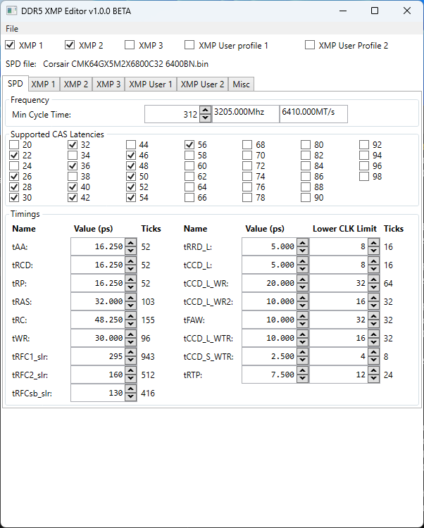

# DDR5 XMP Editor
Editor for DDR5 with XMP 3.0/EXPO. Only for regular, non buffered/non ECC DIMMS.

This is a fork of [SPD-Reader-Writer](https://github.com/integralfx/DDR4XMPEditor), there's no DDR4 support in this fork.

Basic DDR5 support is complete, XMP 3.0 support is mostly complete. EXPO support is in alpha. Tick rounding is not perfect.

# Known bugs
Disabling User Profile 1 rarely works somehow

# Usage
1. Dump the SPD using [SPD-Reader-Writer](https://github.com/1a2m3/SPD-Reader-Writer).
2. Open SPD dump and change settings to whatever you want.
3. Save your modified SPD.
4. Write the modified SPD using SPD-Reader-Writer if it reports a valid checksum (AT YOUR OWN RISK).

# Extras
Some SPD samples are included in SPD examples, plus a XMP block and an EXPO block in case you need to transplant those.

