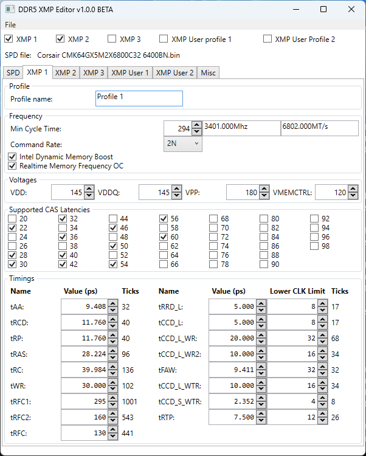

# DDR5 XMP Editor
Editor for DDR5 with XMP 3.0. Only for regular, non buffered/non ECC DIMMS.

Basic DDR5 support is complete, XMP 3.0 support is mostly complete. Tick rounding is not perfect.

This fork defaults to DDR5 mode, although DDR4 functionality is still present. Currently theres no DDR4/DDR5 switch, so you need to change which one you want on ShellViewModel.cs and rebuild.

# Usage
1. Dump the SPD using [SPD-Reader-Writer](https://github.com/1a2m3/SPD-Reader-Writer).
2. Open SPD dump and change settings to whatever you want.
3. Save your modified SPD.
4. Write the modified SPD using SPD-Reader-Writer if it reports a valid checksum (AT YOUR OWN RISK).
